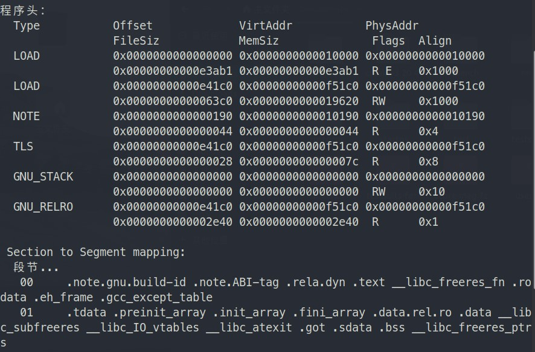
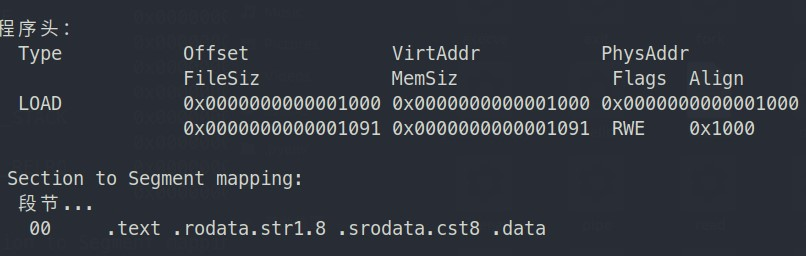
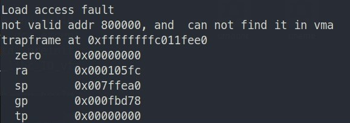
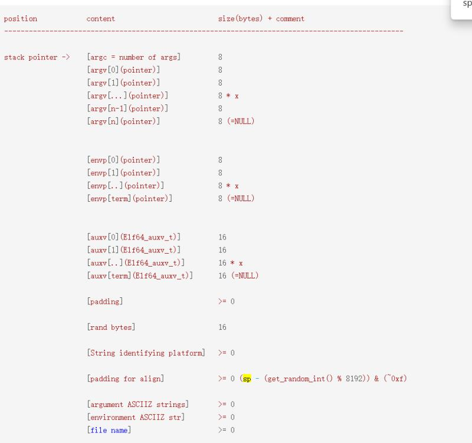

# NPUcore


## 比赛准备和调研

* 官网了解信息

* 了解risv-v体系架构

* 调研k210开发板

* 学习rust，了解rust与c语言开发内核

* github上学习rcore的编写

  **rcore的了解与学习**

  

## 系统框架和模块设计

###  物理内存管理

#### 总览

- 利用C语言数据结果，对动态内存分配实现了伙伴算法；
- 利用Page数据结构建立物理地址管理，实现页式内存管理，实现 `StackFrameAllocator` 进行页面的分配回收工作
- 建立SV39多级页表机制。实现了TLB映射（寻找虚拟地址对应的页表项），并且能够刷新TLB来取消映射。
- 建立 `MemorySet/MapArea` 等数据结构，用于管理地址空间，按段进行映射等。
- 将用户地址空间与内核地址空间隔离开。

#### 动态内存分配

采用 `buddy_system_allocator`

```C
struct Page{
    int ref;//页表参考计数器，用来记录该页被页表引用的次数
    unit32_t flags;//描述页表状态的参数
    unsigned int property;//空闲块（地址连续）的数量
    list_entry_t page_link;//连接多个空闲块的双向链表
};

//管理小连续内存空闲块
typedef struct{
    list_entry_t free_list;//双向链表指针，指向空闲物理页
    unsigned int nr_free;//记录当前空闲页个数
}free_area_t;

```

#### 地址空间

采用分页式内存管理，实现SV39三级页表

通过缺页中断实现页面替换

下面是虚拟内存分配

```c
 * Virtual memory map:                                          Permissions
 *                                                              kernel/user
 *
 *     4G ------------------> +---------------------------------+
 *                            |                                 |
 *                            |         Empty Memory (*)        |
 *                            |                                 |
 *                            +---------------------------------+ 0xFB000000
 *                            |   Cur. Page Table (Kern, RW)    | RW/-- PTSIZE
 *     VPT -----------------> +---------------------------------+ 0xFAC00000
 *                            |        Invalid Memory (*)       | --/--
 *     KERNTOP -------------> +---------------------------------+ 0xF8000000
 *                            |                                 |
 *                            |    Remapped Physical Memory     | RW/-- KMEMSIZE
 *                            |                                 |
 *     KERNBASE ------------> +---------------------------------+ 0xC0000000
 *                            |        Invalid Memory (*)       | --/--
 *     USERTOP -------------> +---------------------------------+ 0xB0000000
 *                            |           User stack            |
 *     IOTOP ---------------> +---------------------------------+ 0x60000000
 *                            |        Fixed mapping for IO     | --/--
 *     IOBASE --------------> +---------------------------------+ 0x30000000
 *                            |                                 |
 *                            :                                 :
 *                            |         ~~~~~~~~~~~~~~~~        |
 *                            :                                 :
 *                            |                                 |
 *                            ~~~~~~~~~~~~~~~~~~~~~~~~~~~~~~~~~~~
 *                            |       User Program & Heap       |
 *     UTEXT ---------------> +---------------------------------+ 0x00800000
 *                            |        Invalid Memory (*)       | --/--
 *                            |  - - - - - - - - - - - - - - -  |
 *                            |    User STAB Data (optional)    |
 *     USERBASE, USTAB------> +---------------------------------+ 0x00200000
 *                            |        Invalid Memory (*)       | --/--
 *     0 -------------------> +---------------------------------+ 0x00000000
```

#### 应用和内核地址空间设置

本内核采用应用空间和内核地址分离的设置。当进入内核态的时候，需要进行地址空间的切换，对于应用而言，内核和其他应用的地址空间被标记为未映射，保证了数据的安全性。

### 进程管理

系统支持线程，采用 `TaskManager` 对线程进行统一管理

`os/src/context.rs` 中定义了线程切换时需要保存的内核栈的内容。

`os/src/manager.rs` 定义了 `TaskManager` 数据结构以及相关的操作。`TaskManager` 用于管理所有进程，负责切换、调度进程。

`os/src/pid.rs` 定义了 `PidAllocator` 用于 `PID` 的分配。同时给`KernelStack`中记录下对应的 `PID`。

`os/src/processor.rs`定义`Processor`用来维护当前CPU运行的进程。包括记录当前进程的任务管理块`TCB`，通过一个空闲执行流`idle`和当前任务执行流的切换来保证两个任务的执行流切换互不可见，保证安全性。

`os/src/switch.rs` 声明了 `__switch` 函数，具体实现是在 `os/src/switch.S` 用汇编编写。这个函数实现了交换两个执行流的上下文。

```asm
__switch:
    # __switch(
    #     current_task_cx_ptr2: &*const TaskContext,
    #     next_task_cx_ptr2: &*const TaskContext
    # )
    # push TaskContext to current sp and save its address to where a0 points to
    addi sp, sp, -13*8
    sd sp, 0(a0)
    # fill TaskContext with ra & s0-s11
    sd ra, 0(sp)
    .set n, 0
    .rept 12
        SAVE_SN %n
        .set n, n + 1
    .endr
    # ready for loading TaskContext a1 points to
    ld sp, 0(a1)
    # load registers in the TaskContext
    ld ra, 0(sp)
    .set n, 0
    .rept 12
        LOAD_SN %n
        .set n, n + 1
    .endr
    # pop TaskContext
    addi sp, sp, 13*8
    ret

```

#### 进程管理

- 进程控制块数据结构 `/kern/process/proc.h`

```c
struct proc_struct {
    enum proc_state state;                      // Process state
    int pid;                                    // Process ID
    int runs;                                   // the running times of Proces
    uintptr_t kstack;                           // Process kernel stack
    volatile bool need_resched;                 // bool value: need to be rescheduled to release CPU?
    struct proc_struct *parent;                 // the parent process
    struct mm_struct *mm;                       // Process's memory management field
    struct context context;                     // Switch here to run process
    struct trapframe *tf;                       // Trap frame for current interrupt
    uintptr_t cr3;                              // CR3 register: the base addr of Page Directroy Table(PDT)
    uint32_t flags;                             // Process flag
    char name[PROC_NAME_LEN + 1];               // Process name
    list_entry_t list_link;                     // Process link list 
    list_entry_t hash_link;                     // Process hash list
    int exit_code;                              // exit code (be sent to parent proc)
    uint32_t wait_state;                        // waiting state
    struct proc_struct *cptr, *yptr, *optr;     // relations between processes
    struct run_queue *rq;                       // running queue contains Process
    list_entry_t run_link;                      // the entry linked in run queue
    int time_slice;                             // time slice for occupying the CPU
    struct files_struct *filesp;                // the file related info(pwd, files_count, files_array, fs_semaphore) of process
};
```

- 分配进程函数 `/kern/process/proc.c`

```c
alloc_proc(void) {
    struct proc_struct *proc = kmalloc(sizeof(struct proc_struct));
    if (proc != NULL) {
        proc->state = PROC_UNINIT;
        proc->pid = -1;
        proc->runs = 0;
        proc->kstack = 0;
        proc->need_resched = 0;
        proc->parent = NULL;
        proc->mm = NULL;
        memset(&(proc->context), 0, sizeof(struct context));
        proc->tf = NULL;
        proc->cr3 = boot_cr3;
        proc->flags = 0;
        memset(proc->name, 0, PROC_NAME_LEN);
        proc->wait_state = 0;
        proc->cptr = proc->optr = proc->yptr = NULL;
        proc->rq = NULL;
        list_init(&(proc->run_link));
        proc->time_slice = 0;
        proc->lab6_run_pool.left = proc->lab6_run_pool.right = proc->lab6_run_pool.parent = NULL;
        proc->lab6_stride = 0;
        proc->lab6_priority = 0;
        proc->filesp = NULL;
    }
    return proc;
}
```

- 进程调度算法采用的是Stride Scheduling调度算法`/kern/schedule/default_sched_stride_c

## 比赛中的中重要进展

- 文件系统采用  `fat32` 实现

  我们参考的代码是通过虚拟文件系统来作为操作系统和更具体的文件系统之间的接口。所谓“具体文件系统”，更接近具体设备和文件系统的内部实现，而“虚拟文件系统”更接近用户使用的接口。但是faft32文件系统和参考代码的虚拟文件系统的接口不是对应，因此我们摒弃了虚拟文件系统，通过直接将相关接口与上层操作系统的接口对应来实现文件系统的迁移。

  首先是通过对代码的阅读，了解系统对于文件的管理方式，首先进程通过一个file结构体数组来管理文件的相关信息，然后通过inode这个结构体来操作文件的的，而通过读fatfs的代码就可以发现，fatfs是通过FIL这个数据结构来具体操作的，因此做了以下修改

  ```c
  struct file {
      enum {
          FD_NONE, FD_INIT, FD_OPENED, FD_CLOSED,
      } status;
      bool readable;
      bool writable;
      int fd;
      off_t pos;
      FIL *node;
      int open_count;
  };
  
  ```

  其次通过对代码阅读发现fatfs的open flag与参考代码的不同所以要做出修改，但又因为大赛要求的open flag与fatfs的也不同，所以还得进一步修改

  ```c
  #define O_RDONLY            1          // open for reading only
  #define O_WRONLY            2          // open for writing only
  #define O_RDWR              3          // open for reading and writing
  ```

  上面的是为了fatfs和OS之间适配做的修改，下面是对系统调用接口的修改

  ```c
      uint32_t open_flags = (uint32_t)arg[2]+1;
  ```

  之后是对于一些接口的替换，

  file_open

  ```c
      FIL *node;
      node=kmalloc(sizeof(FIL));
      if ((ret = f_open(node,path, open_flags)) != 0) {
          fd_array_free(file);
          return ret;
      }
  ```

  file_close

  ```c
      if (file->status == FD_CLOSED) {
          f_close(file->node);
      }
      kfree(file->node);
  ```

  file_read

  ```c
      uint32_t v_ret_len = 0;
      ret = f_read(file->node, base, len, &v_ret_len);
      *copied_store=v_ret_len;
  ```

  file_write

  ```c
      uint32_t v_ret_len = 0;
      ret = f_write(&file->node, base, len, &v_ret_len);
      *copied_store=v_ret_len;
  ```

  file_seek (由于fatfs并不支持从当前位置和从结尾开始，所以只能做以下修改)

  ```c
      fd_array_acquire(file);
      ret=f_lseek(file->node,pos);
  ```

  其他的一些迁移比较类似，再补全一些参考代码里面只有接口没有实现或者干脆没有接口但大赛要求的的一些地方进行修改

  然后是将文件系统与sd驱动结合

  ```c
  DSTATUS disk_initialize(BYTE pdrv)
  {
      sd_init() ;
      return 0;
  }
  DRESULT disk_read(BYTE pdrv, BYTE *buff, DWORD sector, UINT count)
  {
      if(sd_read_sector(buff, sector, count) == 0)
          return RES_OK;
      return RES_ERROR;
  }
  DRESULT disk_write(BYTE pdrv, const BYTE *buff, DWORD sector, UINT count)
  {
      if(sd_write_sector((BYTE *)buff, sector, count) == 0)
          return RES_OK;
      return RES_ERROR;
  }
  DRESULT disk_ioctl(BYTE pdrv, BYTE cmd, void *buff)
  {
      DRESULT res = RES_ERROR;
  
      switch(cmd)
      {
          /* Make sure that no pending write process */
          case CTRL_SYNC:
              res = RES_OK;
              break;
          /* Get number of sectors on the disk (DWORD) */
          case GET_SECTOR_COUNT:
              *(DWORD *)buff = (cardinfo.SD_csd.DeviceSize + 1) << 10;
              res = RES_OK;
              break;
          /* Get R/W sector size (WORD) */
          case GET_SECTOR_SIZE:
              *(WORD *)buff = cardinfo.CardBlockSize;
              res = RES_OK;
              break;
          /* Get erase block size in unit of sector (DWORD) */
          case GET_BLOCK_SIZE:
              *(DWORD *)buff = cardinfo.CardBlockSize;
              res = RES_OK;
              break;
          default:
              res = RES_PARERR;
      }
      return res;
  }
  ```


- 部分系统调用的实现

  | 调用编号     |
  | ------------ |
  | text_echo6   |
  | brk15        |
  | mmap17       |
  | unmap23      |
  | pipe24       |
  | clone29      |
  | execv        |
  | exit         |
  | fork         |
  | getpid       |
  | getppid      |
  | wait         |
  | yield        |
  | waitpid      |
  | gettimeofday |
  | sleep        |
  | times        |
  | chdir        |
  | close        |
  | dup          |
  | dup2         |
  | fstat        |
  | getcwd       |
  | getdents     |
  | mkdir        |
  | mount        |
  | open         |
  | opennet      |
  | read         |
  | unlink       |
  | write        |
  | unmount      |
  | uname        |

  

## 遇到的问题和解决方法

### 用户程序空间不足

- 问题描述：

  用户程序运行时报报内存越界

- 解决方案

  修改内核用户空间，起始地址放在更低的地址空间


### 文件读取失败

- 问题描述：

  评测平台读取文件失败

- 解决方案

  文件系统被识别成fat16，系统启动时将其死成fat32

### 系统调用对接问题

- 问题描述：

  我们在支持一些系统调用时发现有些系统调用不怎么了解，因此对其实现起来毫无头绪，比如 `msgctl`、`setscheduler`、`madvise`等，完全不了解其作用和原理，因此浪费了大量时间在寻找资料上，实际留给开发的时间并不多，导致我们的时间安排非常紧张。

- 解决方案

  此问题没有特别好的解决方法，我们能做的只有尽量支持我们有能力支持的系统调用，不懂的那些仍然需要不断地积累。


### 在k210上系统难以调试

- 问题描述：

  在 k210 上开发，比较困难的一点就是不好调试，很多时候出个错误也没多少错误信息从而导致开发调试查错难度增大。这需要有合适的调试手段，而 k210 是采用 `miniterm` 通过串口连接的，无法直接使用gdb等调试工具。

- 解决方案

  对此我们的解决办法是先在 qemu 上运行程序进行调试分析，然后再烧录至 k210。比如我们虽然没有能力全部支持busybox 等程序的所有功能，为了争取得分，我们想知道其内部的一个小命令运行的最少系统调用，因此在 qemu 上运行 `starce` 跟踪系统调用情况，然后着手进行支持。


### ELF程序的LOAD段问题

- 问题描述：

  运行 busybox、lmbench 时出现 Load Acess fault 错误

- 解决方案

  我们在支持 busybox 的阶段就发现了 busybox、lmbench 程序相比第一阶段的测试程序，ELF 文件多了需要 LOAD 的段，以 lmbench 为例，通过 `readelf -l lmbench_all` 查看 lmbench ELF文件的信息(如下图所示)

  

  而初赛阶段的测试程序 open 的 ELF 信息则是

  

  可以看出 lmbench 多了许多段需要加载，而根据之前群里大家的讨论和北京航空航天大学的同学直播介绍，我们判断是由于只读数据和可读写数据放在了同一页，第二个 LOAD 的段没有按页对齐，因此才会在执行时出现段加载错误(如下图所示)。

  

  此问题讨论出的解决办法是对加载 LOAD 段时对虚拟地址按页向下取整，但是我们对虚拟地址进行按页向下取整以后，仍然出现此问题，我们又从从 ELF 加载的源码一步步分析，也没能找出问题所在，因此非常遗憾我们的 lmbench 和 busybox 的支持没能取得较好的进展。


### 用户栈初始化问题

- 问题描述：
  在busybox、lmbench等程序运行时读取不到参数

- 解决方案
  按照busybox、lmbench要求(如下图所示)，对调用栈进行正确的初始化，并设置环境变量等

  

## 作品特征描述

- 基于ucore
- c语言编写
- 基于k210与qemu平台
- 良好的user/lib

## 提交仓库目录和文件描述

### 文件目录

- kern：操作系统源码
- 图片：readme使用图片
- Makefile：编译脚本
- README.md: 自诉文件

### kern文件结构

```c
.
├── kern
│   ├── debug
│   │   ├── assert.h
│   │   ├── kdebug.c
│   │   ├── kdebug.h
│   │   ├── kmonitor.c
│   │   ├── kmonitor.h
│   │   ├── panic.c
│   │   └── stab.h
│   ├── driver
│   │   ├── clock.c
│   │   ├── clock.h
│   │   ├── console.c
│   │   ├── console.h
│   │   ├── fpioa.c
│   │   ├── fpioa.h
│   │   ├── gpiohs.c
│   │   ├── gpiohs.h
│   │   ├── ide.c
│   │   ├── ide.h
│   │   ├── intr.c
│   │   ├── intr.h
│   │   ├── io.h
│   │   ├── kbdreg.h
│   │   ├── picirq.c
│   │   ├── picirq.h
│   │   ├── ramdisk.c
│   │   ├── ramdisk.h
│   │   ├── sdcard.c
│   │   ├── sdcard.h
│   │   ├── spi.c
│   │   ├── spi.h
│   │   ├── sysctl.c
│   │   └── sysctl.h
│   ├── fs
│   │   ├── ccsbcs.c
│   │   ├── devs
│   │   │   ├── dev.c
│   │   │   ├── dev_disk0.c
│   │   │   ├── dev.h
│   │   │   ├── dev_stdin.c
│   │   │   └── dev_stdout.c
│   │   ├── diskio.c
│   │   ├── diskio.h
│   │   ├── ff.c
│   │   ├── ffconf.h
│   │   ├── ff.h
│   │   ├── file.c
│   │   ├── file.h
│   │   ├── fs.c
│   │   ├── fs.h
│   │   ├── integer.h
│   │   ├── iobuf.c
│   │   ├── iobuf.h
│   │   ├── sfs
│   │   │   ├── bitmap.c
│   │   │   ├── bitmap.h
│   │   │   ├── sfs.c
│   │   │   ├── sfs_fs.c
│   │   │   ├── sfs.h
│   │   │   ├── sfs_inode.c
│   │   │   ├── sfs_io.c
│   │   │   └── sfs_lock.c
│   │   ├── swap
│   │   │   ├── swapfs.c
│   │   │   └── swapfs.h
│   │   ├── sysfile.c
│   │   ├── sysfile.h
│   │   └── vfs
│   │       ├── inode.c
│   │       ├── inode.h
│   │       ├── vfs.c
│   │       ├── vfsdev.c
│   │       ├── vfsfile.c
│   │       ├── vfs.h
│   │       ├── vfslookup.c
│   │       └── vfspath.c
│   ├── init
│   │   ├── entry.S
│   │   └── init.c
│   ├── libs
│   │   ├── readline.c
│   │   ├── stdio.c
│   │   ├── string.c
│   │   └── util.c
│   ├── mm
│   │   ├── default_pmm.c
│   │   ├── default_pmm.h
│   │   ├── kmalloc.c
│   │   ├── kmalloc.h
│   │   ├── memlayout.h
│   │   ├── mmu.h
│   │   ├── pmm.c
│   │   ├── pmm.h
│   │   ├── swap.c
│   │   ├── swap_fifo.c
│   │   ├── swap_fifo.h
│   │   ├── swap.h
│   │   ├── vmm.c
│   │   └── vmm.h
│   ├── process
│   │   ├── entry.S
│   │   ├── proc.c
│   │   ├── proc.h
│   │   └── switch.S
│   ├── schedule
│   │   ├── default_sched_c
│   │   ├── default_sched.h
│   │   ├── default_sched_stride.c
│   │   ├── sched.c
│   │   └── sched.h
│   ├── sync
│   │   ├── check_sync.c
│   │   ├── monitor.c
│   │   ├── monitor.h
│   │   ├── sem.c
│   │   ├── sem.h
│   │   ├── sync.h
│   │   ├── wait.c
│   │   └── wait.h
│   ├── syscall
│   │   ├── syscall.c
│   │   └── syscall.h
│   └── trap
│       ├── trap.c
│       ├── trapentry.S
│       └── trap.h
├── libs
│   ├── atomic.h
│   ├── defs.h
│   ├── dirent.h
│   ├── elf.h
│   ├── error.h
│   ├── hash.c
│   ├── list.h
│   ├── printfmt.c
│   ├── rand.c
│   ├── riscv.h
│   ├── sbi.h
│   ├── skew_heap.h
│   ├── stat.h
│   ├── stdarg.h
│   ├── stdint.h
│   ├── stdio.h
│   ├── stdlib.h
│   ├── string.c
│   ├── string.h
│   ├── unistd.h
│   └── util.h
├── Makefile
├── README.md
├── result
├── tools
│   ├── boot.ld
│   ├── function.mk
│   ├── gdbinit
│   ├── grade.sh
│   ├── kernel.ld
│   ├── kflash.py
│   ├── mksfs.c
│   ├── rustsbi-k210.bin
│   ├── sign.c
│   ├── user.ld
│   └── vector.c
└── user
    └── libs
        ├── dir.c
        ├── dir.h
        ├── file.c
        ├── file.h
        ├── initcode.S
        ├── lock.h
        ├── panic.c
        ├── stdio.c
        ├── syscall.c
        ├── syscall.h
        ├── ulib.c
        ├── ulib.h
        └── umain.c
```

## 比赛收获

​	总的来说我们这个系统还是很不完全，里面还充斥着各种各样的bug，但是这个比赛对我们来说确实是一次非同寻常的学习经历，通过不断地debug和处理各种各样离奇的错误，有许多细节是平时的操作系统课上根本不会涉及到的，这要求我们不断地自主的去寻求帮助。但也是在这样的过程中，我们成长了许多。

​	后续希望能学习其他同学优秀的作品，能处理里面现在还存在的问题，或者找到解决办法。将更新更高效的一些操作系统思想添加进去。

