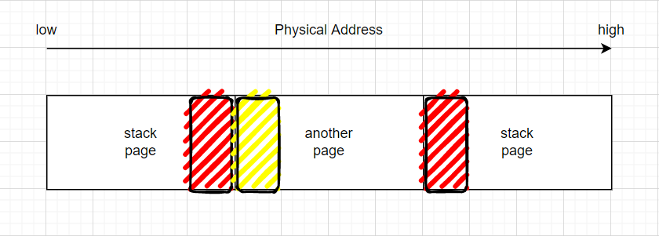
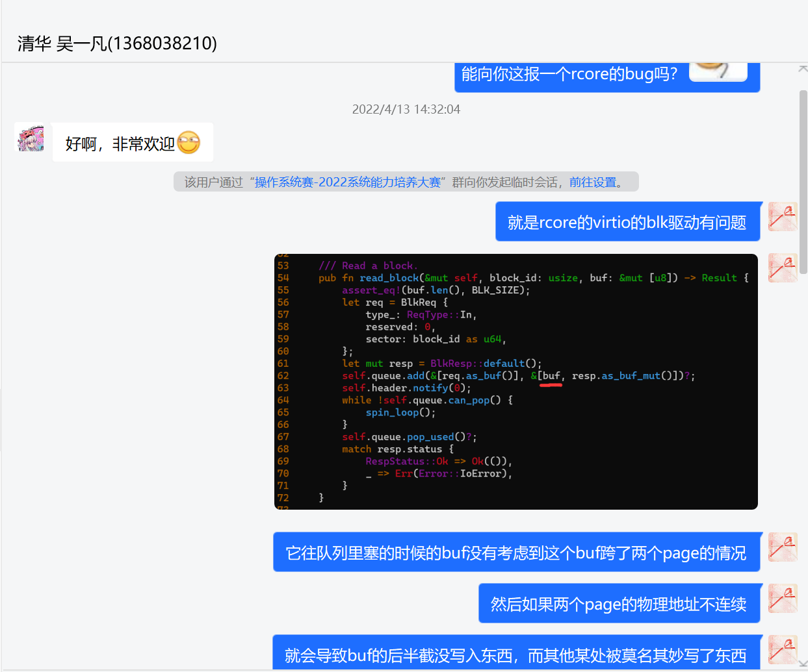

## 问题发现

在平时开发的时候，我们不会在K210开发板上测试，而是在使用qemu虚拟机上开发，在内核开发越来越多的时候发生了一个怪现象，我们发现了在做回归测试的时候出现了文件加载完后运行失败panic返回shell的情况，更奇怪的一点是在shell多次调用其他程序之后都出现了不同程度的崩溃，更有甚者在panic之后shell都返回不了，操作系统直接卡死。

## 问题探索

本来我们以为是文件本身有问题就重新编译了一份放进块设备里，但是问题仍然出现，说明了不是文件本身问题，于是开始推测是文件系统出了问题，由于初期开发对fat32文件系统并不是很熟悉，我们使用了去年哈工大`Ultra OS`的文件系统部分作为初期开发的文件系统的替代，于是就猜测是这部分的代码可能有一些边界情况没有考虑到。在翻看了文件系统代码一两天后发现依然没有什么问题，虽然在实现上不是那么高效，但是看上去没有找到明显错误。

之后无意间我们用K210开发板上测试了一下，发现程序能够正常跑通，这就很不合理，本能地怀疑了是否底层驱动是否有问题，对于K210开发板来说有专门的端口用于跟tf卡交互，对于qemu虚拟机来说是用Virt-IO这套虚拟输入输出接口跟块设备进行交互，这是两套完全不一样的驱动。

在怀疑Virt-IO驱动有问题后依然感到迷惑，平时都用着很正常的Virt-IO驱动怎么会有问题，这份Virt-IO是rCore的配套代码，怎么可能出问题，于是我们准备做实验：

```rust
{
    //...
    let mut buffer = [0u8; 512];
    block_device.read_block(/*params...*/);
    log::error("block_id: {}, buffer: {:?}\n", block_id, buffer);
}
```

经过长时间的打印，发现对于相同的`block_id`，在若干次读入后`buffer`里面对应的值发生了变化，而且奇怪的是它从某一个位置开始，后面全是`0`，像是没有被写入过，经过我们讨论过后有两种可能：

1. 在我们读入之后块设备被不明操作给写入了，导致再次读入的时候出现了变化
2. 驱动本身可能存在一些问题导致读入没有成功

对于第一种可能，我们采取了在`write_block`（块设备写入接口）放置一个panic来检测是否发生过写入的情况，测试的结果是根本没有写入的情况，那么剩下的就只有第二种可能。

驱动本身我们找了一些讲解Virt-IO的博客，文档，依然没有什么好的思路，最后就只能对着驱动源码看，看看是否有什么不对劲的地方，又看了两三天后的晚上管孙笛发现有点不对劲，经过大胆猜想后修好了程序。

## 问题原因

先需要讲明`NPUCore`的内存分布：


在内核中，进程的用户栈的虚拟地址是固定的，而且是动态分配的，这会导致在用户栈中的两个连续页面的物理地址可能不连续。

如下图，假设我们要读入一个buffer，它对应的虚拟地址是连续的，但是物理地址可能就分成两段（红色区域），而交给Virt-IO驱动的时候虚拟机实际上会先将buffer的首地址先转成物理地址，然后基于物理地址（`NPUCore`的物理地址本质上等价于qemu的虚拟地址）再交给Linux进行相应的读写操作，那么这样读入会导致黄色区域的数据被意外地读进来替换掉了，而原来右侧的红色区域啥都没读进来，这样就能解释得通为什么新的子进程会奔溃甚至会导致原来老的进程也崩溃。



## 问题解决

既然明白当buffer发生跨页的时候会产生读入bug，就可以通过将原来的buffer进行切片，在保证切好片后不会发生跨页就可以了，即保证塞进Virt queue的buffer在没有影响读入逻辑顺序的前提下没有产生任何跨页。

现已将bug反馈给清华大学吴亦凡同学，近期修复了该bug。

