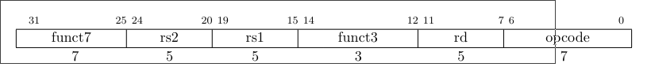
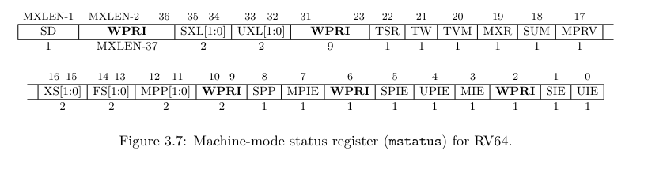
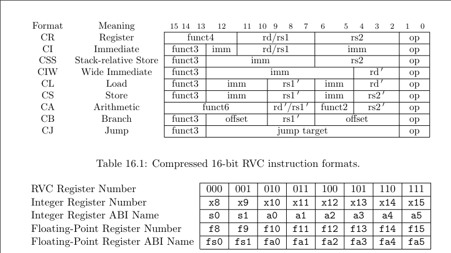

# Table of Contents

1.  [问题简介](#org7ba5872)
2.  [普通处理的实现](#org4895af6)
    1.  [对k210的SBI进行委托](#org45489d6)
    2.  [对异常进行处理](#org8e1a44d)
        1.  [开头](#orgd18d18b)
        2.  [对常规不对齐指令的处理](#org75d84a3)
        3.  [对压缩不对齐指令的处理](#orgd665a81)


<a id="org7ba5872"></a>

# 问题简介

在测评的初期, 由于链接的原因, 测试样例中链接的malloc不保证分配到的内存的地址是对齐的, 但k210板本身不支持不对齐读(所有读写指令需要和对应的数据单位对齐, 例如 \`sd\` 8字节对齐, \`sh\` 2字节对齐等), 第一个出现的测例应该是memstream

尽管后来这个解决方案的必要性随着的问题的解决(官方重新编译)而消失, 但考虑到对将来的潜在作用,这一档案仍然留底

注意, 我们不建议将这个解决方案用在特殊寄存器和特殊地址的读取上, 只是一个比赛的临时解决方案, 

部分的特殊地址的读取可能要按照"寄存器"为单位(内存中的地址只是映射出来的, 实际上是对应的寄存器)


<a id="org4895af6"></a>

# 普通处理的实现


<a id="org45489d6"></a>

## 对k210的SBI进行委托

我们从图片中可以看到, 这个问题的报错是出现在SBI中, 所以问题很可能从SBI处解决. 

事实上, k210是实现的是1.9的特权级指令, 但 \`rdtime\` 指令实际上是不被这个版本支持的.

其在RustSBI-k210上的支持是通过SBI进行模拟进行实现的.

这启发我们将所有的Load/StoreMisaligned问题都委托给SBI, 由其进行读取并解决

在SBI的main函数中我们找到下列代码(\`main.rs\`): 

```rust
// 委托终端；把S的中断全部委托给S层
fn delegate_interrupt_exception() {
    use riscv::register::{medeleg, mideleg, mie};
    unsafe {
        //mideleg::set_sext();
        mideleg::set_stimer();
        mideleg::set_ssoft();
        medeleg::set_instruction_misaligned();
        medeleg::set_breakpoint();
        medeleg::set_user_env_call();
        /* MMU Exception Delegation
        /* Page Faults are *Reserved* in 1.9.1 version */
        - medeleg::set_instruction_page_fault();
        - medeleg::set_load_page_fault();
        - medeleg::set_store_page_fault();
        - medeleg::set_load_misaligned();
        - medeleg::set_store_misaligned();
        /* Actually, in 1.9.1 they are merged into more general exceptions */
        + medeleg::set_instruction_fault();
        + medeleg::set_load_fault();
        + medeleg::set_store_fault(); */
        // medeleg::set_instruction_fault();
        // medeleg::set_load_fault();
        // medeleg::set_store_fault();
        // 默认不打开mie::set_mext
        // 不打开mie::set_mtimer
        mie::set_msoft();
    }
}
```

可以发现这里实际上有读写不对齐, 我们把他移出注释即可.


<a id="org8e1a44d"></a>

## 对异常进行处理


<a id="orgd18d18b"></a>

### 开头

顺着函数 \`delegate\_interrupt\_exception()\` 的引用, 我们可以找到主函数调用的真正的处理函数

工作主要在此展开(来自文件 \`execute.rs\` )

```rust
pub fn execute_supervisor(supervisor_mepc: usize, a0: usize, a1: usize) -> ! {
    let mut rt = Runtime::new_sbi_supervisor(supervisor_mepc, a0, a1);
    loop {
        match Pin::new(&mut rt).resume(()) {
            GeneratorState::Yielded(MachineTrap::IllegalInstruction()) => {
                let ctx = rt.context_mut();
                // FIXME: get_vaddr_u32这个过程可能出错。
                let ins = unsafe { get_vaddr_u32(ctx.mepc) } as usize;
                if !emulate_illegal_instruction(ctx, ins) {
                    unsafe {
                        if feature::should_transfer_trap(ctx) {
                            feature::do_transfer_trap(
                                ctx,
                                Trap::Exception(Exception::IllegalInstruction),
                            )
                        } else {
                            fail_illegal_instruction(ctx, ins)
                        }
                    }
                }
            }

            /* 部分其他的处理函数省略...
             *
             */
```


​    
```rust
            /* K210 implements only priv. 1.9.1 which doesn't contain a real `mtval` register,
             * but only a `mbadaddr` register.
             * However, it seems that the abi is actually the same for the access of the two.
             */
            GeneratorState::Yielded(MachineTrap::StoreMisaligned(addr)) => {
                handle_store_misal_native(addr, &mut rt);
            }
            GeneratorState::Complete(()) => unreachable!(),
        }
    }
}
```

这里有大段的转发进来的各种异常和陷入, 我们可以从中模仿写出这样的简单框架代码, 插入其中:

```rust
GeneratorState::Yielded(MachineTrap::LoadMisaligned(addr)) => {
    handle_load_misal_native(addr, &mut rt);
}
GeneratorState::Yielded(MachineTrap::StoreMisaligned(addr)) => {
    handle_store_misal_native(addr, &mut rt);
}
```

<a id="org75d84a3"></a>

### 对常规不对齐指令的处理

1. 译码

   首先模仿之前的非法指令处理, 我们可以得出下列代码

   ```rust
   let ctx = rt.context_mut();
   let ins = unsafe { get_vaddr_u32(ctx.mepc) };
   ```

   至于所有的需要进行类型转换的, 建议直接使用Rust的语法进行.

   对各种load指令, 获取对应的寄存器使用的方式如下: 

   ```rust
   let rd = get_rd(ins);
   let dst_reg: &mut usize = match rd {
       1 => &mut rt.context_mut().ra,
       2 => &mut rt.context_mut().sp,
       3 => &mut rt.context_mut().gp,
       4 => &mut rt.context_mut().tp,
   
       5 => &mut rt.context_mut().t0,
       6 => &mut rt.context_mut().t1,
       //...后面的就省略了
       _ => panic!("unknown register: {}", rd),
   };
   ```

   普通指令的布局如下(来自The RISC-V Instruction Set Manual Volume I User-Level ISA Pg44(62 of 238)), 

   

   可以很容易地从位运算提取出需要的funct和各种寄存器号

   另外, 地址不建议自己计算, 直接用mtval寄存器的结果就好(在异常枚举类型中已经包含).

2. 地址空间选定

   首先, 从模仿下方的代码 \`get\_vaddr\_u64(vaddr:usize)\` ,

   ```rust
   #[inline]
   unsafe fn get_vaddr_u16(vaddr: usize) -> u16 {
       let mut ans: u16;
       asm!("
           li      {2}, (1 << 17)
           csrrs   {2}, mstatus, {2}
           lhu     {0}, 0({1})
           csrw    mstatus, {2}
       ", out(reg) ans, in(reg) vaddr, out(reg) _);
       ans
   }
   ```

   查阅手册(The RISC-V Instruction Set Manual
   Volume II: Privileged Architecture 20190608-Priv-MSU-Ratified, pg 22(34 of 91)),有:

   > When MPRV=1, load and store memory
   > addresses are translated and protected as though the current privilege mode were set to MPP.

   可以知道csrrs和csrw是为了S级的内存空间查找

   我们可以得到, 写入用户空间时候首先需要改变mprv寄存器
   

   这可以让其暂时变为S态的地址访问, 为了之后的方便, 构造下列函数:

   ```rust
   #[inline]
   unsafe fn s_lv_translation_mode_on() {
       asm!("
   li {0}, (1<<17)
   csrrs {0}, mstatus, {0}
   ", out(reg) _);
   }
   
   #[inline]
   unsafe fn s_lv_translation_mode_off() {
       asm!("
   li {0}, (1<<17)
   csrw mstatus, {0}", out(reg) _)
   }
   ```

3. 读取/储存代码

   自行编写汇编代码固然可行, 但对比赛而言其实不太可靠.

   如果你有尝试过自己写FAT32文件系统(其中紧凑的数据结构), 可能会注意到unsafe方法 \`const\_ptr::read\_unaligned()\`

   ```rust
   unsafe {
       s_lv_translation_mode_on();
       let tmp_reg = (addr as *const i8).read_unaligned() as usize;
       s_lv_translation_mode_off();
       *dst_reg = tmp_reg;
   }
   ```

   对写也有对应的 \`mut\_ptr::write\_unaligned()\`

   这种赋值方式是为了确保其能尽可能将结果保存在寄存器中

   **注意**

   如果你将dst\_reg存储指令写到中间, 一定会停机

   不过, 对于高可靠性的场景, 由于这种写法并不能要求其中间的变量全部通过寄存器传递(编译器不溢出)
   注意, 不要将读写M态内存的指令/操作和计算addr的指令放到开关MPRV中间, 否则会导致死机(在S地址空间下访问了M态地址的结果)

   这种情况在k210上的表现往往是read可以用, 但write的不对齐指令就完全无法使用.

4.  取指

    如题, 如果你发现代码执行后, 不再发生Misaligned了, 改成出现"死锁"了
    
    恭喜你, 应该是忘了pc+4, 马上补上(在代码结尾)
    
    ```rust
    ctx.mepc = ctx.mepc.wrapping_add(4);
    ```


<a id="orgd665a81"></a>

### 对压缩不对齐指令的处理

如果你尝试了之前的代码, 会发现其只能解决到entry-static.exe的问题, 对于动态的依然无法解决

报错显示出现了不明的操作码, 查阅(基本指令手册)手册可以发现其实际上是压缩指令

这是因为其动态版本使用了压缩指令, 其译码和正常的32位指令完全不同, 需要重写

1.  译码

    区分其实很简单, 根据手册, 可以发现其使用的op\_code是不同的(虽然你可能是通过funct代码不同意识到这种指令存在的)
    
    但由于布局不同, 需要重写译码部分, 这里重复性较强不再赘述, 只给出其对应的布局
    
    (The RISC-V Instruction Set Manual Volume I User-Level ISA Pg100(121 of 238))
    

2.  记得加2

    对于没记得改压缩指令增加的同学, 如果没出意外的话你估计是要出意外了
    
    程序居然会尝试写入zero寄存器(硬编码为0的常量寄存器), 这是因为其每个压缩指令的偏移量是2, 如果读错了会产生错误的结果
    
    显然, 压缩指令的意义在于用一半的空间储存指令, 所以对于检测出是压缩指令的情况要记得加2

