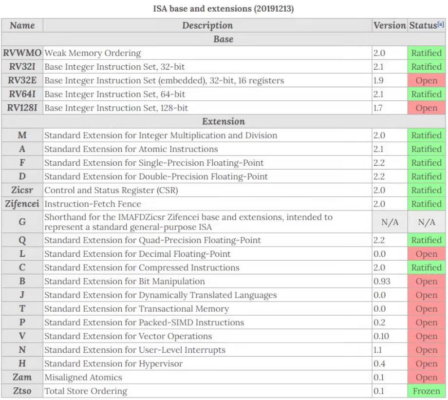
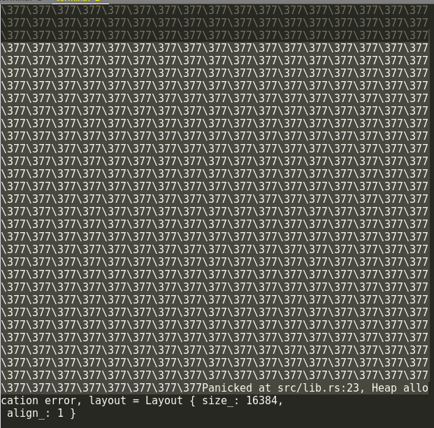

# 技术细节与错误文档

## OpenSBI兼容与跨平台

### 浮点指令引发的Illegal Instruction

尝试在QEMU上运行busybox时，会出现Illegal Instruction异常，导致busybox退出。从`sepc`寄存器读出引发异常的指令地址，根据反汇编代码可以得知该指令为浮点数存储指令`fsd`。

```assembly
   d4104:	06253023          	sd	sp,96(a0)
   d4108:	06153423          	sd	ra,104(a0)
   d410c:	b920                	fsd	fs0,112(a0)
   d410e:	bd24                	fsd	fs1,120(a0)
   d4110:	09253027          	fsd	fs2,128(a0)
   d4114:	09353427          	fsd	fs3,136(a0)
   d4118:	09453827          	fsd	fs4,144(a0)
   d411c:	09553c27          	fsd	fs5,152(a0)
   d4120:	0b653027          	fsd	fs6,160(a0)
   d4124:	0b753427          	fsd	fs7,168(a0)
   d4128:	0b853827          	fsd	fs8,176(a0)
   d412c:	0b953c27          	fsd	fs9,184(a0)
   d4130:	0da53027          	fsd	fs10,192(a0)
   d4134:	0db53427          	fsd	fs11,200(a0)
````

使用`riscv64-imac`编译目标可以避免该问题。如图，使用imac编译目标产生的二进制文件不包含浮点数指令：



但是比较奇怪的是，在k210上未见上述问题。另外，我们发现使用OpenSBI也可以避免该问题（此前我们一直在使用RustSBI）。根据官方交流群里的一些讨论，我们得知，问题的根本原因在于RustSBI-QEMU不支持浮点数指令。考虑到imac编译目标可能存在软件模拟浮点运算产生的性能损失，所以最终我们决定在QEMU上使用OpenSBI。

### OpenSBI的非阻塞getchar

当我们尝试QEMU上使用OpenSBI的时候，遇到了以下问题：



可以看到，终端不停地输出`\377`，并且最终导致内核堆空间不足。那么我们就从终端的输出入手，尝试解决这个问题。`\377`是什么？以`\`开头，提示我们这应该是一个转义字符，其后是八进制形式的编码值。而 377(o) = 255(d)，考虑终端输出的数据为char型，255其实很可能是-1，暗示着某个函数的失败返回。同时，`Heap Allocation Error`是来自内核的错误报告，我们可以肯定OpenSBI的引导过程是成功的。通过以上信息，结合gdb跟踪调试，我们发现问题在于RustSBI和OpenSBI对SBI调用`console_getchar`的实现方式不同：RustSBI提供的`console_getchar`是阻塞的，也就是说，在未接受到终端的输入时，这个函数不会返回。而OpenSBI提供的`console_getchar`是非阻塞的，在未接受到终端的输入时，这个函数返回-1。

为了兼容OpenSBI，我们需要在内核中检查`console_getchar`的返回值，过滤其中的-1，就能解决这个问题。

## 内存问题

### rCore页表结构
首先要谈到我们继承自rCore的页表结构.rCore的空间分为用户和内核空间两类(虽然其他部分页表合并的系统则是一种空间,但rCore没有这么做),一个页表就是一个内存空间.每个程序有自己的用户页表,但内核的页表只有一个.此外,不论在内核空间还是用户空间,都有自己的栈和堆的概念.当切换地址空间,实际上是切换了页表地址(让CPU自行查找), 同时每个程序有自己的内核栈空间,用户的栈,堆空间,所以在切换到内核空间的时候如果要访问用户地址空间下的数据结构. 内核使用的是物理地址(但内核栈也用虚拟地址), 故对用户空间的直接翻译可能是错的.

### 跨页修改问题
基于之前的叙述,使用`translated_ref`和`translated_refmut`两个函数直接读取的方式本身是很不安全的,因为其设计是在内核页表下对物理地址上到结构体长度结束的区间直接翻译为`&T`或`&mut T`, 但这可能跨页. 部分的程序员会使用这种很简单但错误的解决方法直接从用户空间读取,但这会带来不可预测的风险,所以我们应当将其改掉. 首先注意到, rCore的原版处理方案是使用的`UserBuffer`, 其原理是用`for`循环给每个字节进行一次手动翻找页表的翻译,然后配备一个单独的指针,并存入一个数组中,然后直接通过指针访问每个字节.这个方法正确但效率不高,最好是通过数组的数组进行,对其中的长度和页地址取`min`的最小值,然后从第一个数组开始到下一个类似地址,以此类推从而覆盖整个`UserBuffer`. 此外,部分代码还是会习惯于使用这两个API进行用户空间的翻译,一般来说这是不可取的,应该替换为`UserBuffer`.

### 部分内容不一定要严格使用用户页表读写

`os::task`中类似于`task::exec()`的功能中有的部分其实很适合直接使用`translated_refmut()`和`translated_ref()`进行读写,因为这些内容本身是(具体需要查看)按页对齐且大小明显(或者至少几乎)不超过1页,那么直接使用`translated_ref`系列未检查的代码是基本可用的. 类似的操作在Linux中也有出现.

## rCore非Linux标准接口和行为及其标准化

### sys_exec()

#### 用户程序参数加载方式问题

##### 问题历史

lmbench的正确执行要求系统调用sys_exec()正常执行时返回0。但是这与rCore的用户程序产生了冲突，因为rCore的用户程序要求系统调用sys_exec()正常执行时返回参数的个数(argc)。如果简单地将返回值改为0，那么rCore的用户程序将无法正常运行，例如使用rCore的用户程序`cat xxx.txt`尝试读取文件系统之中的任何一个文本文件，用户程序将提示用户程序应当收到多于一个额外参数，但事实上没有收到任何额外参数，无法正确运行。

查阅不同的文献资料可以发现以下几个特性:首先, POSIX技术标准之中并没有所谓的sys_exec()的系统调用。它对应的实际上是一系列不同的其他系统调用家族，而这个rCore实现的系统调用只是其中的一个(execve)的弱化版本。手册之中还提到应当认为这个函数本身是永远不返回的，而当且仅当它的执行出现了错误的时候才会返回-1，作为函数的返回值。
另外通过阅读rCore的手册可以知道该函数实际返回的值是参数的数量。且返回值填入的寄存器是a0(10号寄存器)

##### 初步解决的过程

首先经过GDB的跟踪可以发现在代码之中，如果它的用户程序的额外参数数量是零个，那么本身main函数之中，是不会尝试复制任何的地址，也就是说强迫其对地址进行访问，仍然会导致内存越界访问而最终错误退出，那么也就是说这个问题可能并不只是单纯的用户程序参数的数量argc不对的问题。
另一方面也要考虑到在决赛之中，busybox的运行本身是依赖用户程序参数的，也就是说如果这个用户程序本身是完全失败的，那么他必然不可能完全能够运行这些东西。
另外这个问题本身还引申出了另一个疑问，就是对于参数来说，如果说它不应当被存到寄存器上，而应当在寄存器上返回0，那么它到底是如何正确得到用户程序本身的参数数量argc和参数地址argv的？
我们同时观察了rCore实现的exec()函数，似乎他将用户程序本身的参数准备分为两个部分，一个部分是将其正确的写入到所谓的寄存器之中，另一部分是将寄存器之中的用户程序参数数量和用户程序参数指针的数组都存到了内存的某个地址。这有可能说明确实存在两种不同的参数加载方式。

通过观察可以发现rCore用户程序(链接rCore userlib)的主函数和C语言编写的用户程序(链接musl libc)的主函数，可以发现它们的参数形式不同，这说明说他们很有可能是通过了不同的方式导入了用户编写的主函数。
至少对C语言来说，通过文件夹结构来看，它很可能存在include之中的某个位置。翻找之后可以找到crt0这个东西。

rCore用户程序中的main是如此处理其参数问题的:

``` c
#include <unistd.h>

extern int main();

int __start_main(long *p)
{
	int argc = p[0];
	char **argv = (void *)(p+1);

	exit(main(argc, argv));
	return 0;
}
```

而调用这个函数的crt.S的处理是这样的:

``` asm
.section .text.entry
.globl _start
_start:
    mv a0, sp
    tail __start_main
```

调用只有简单的一行,然后反汇编结果(brk测试程序,分号后为注释):

``` openqasm
_start:
    ;mv a0, sp
    1000:	850a                	mv	a0,sp
    ;tail __start_main
    1002:	a855                	j	10b6 <__start_main>

;int __start_main(long *p)
00000000000010b6 <__start_main>:
;{
    10b6:	85aa                	mv	a1,a0
	int argc = p[0];
	char **argv = (void *)(p+1);

	exit(main(argc, argv));
    10b8:	4108                	lw	a0,0(a0) ;获取argc
;{
    10ba:	1141                	addi	sp,sp,-16
	exit(main(argc, argv));
    10bc:	05a1                	addi	a1,a1,8 ;获取argv
;{
    10be:	e406                	sd	ra,8(sp)
;	exit(main(argc, argv));
    10c0:	fe7ff0ef          	jal	ra,10a6 <main>
    10c4:	39b000ef          	jal	ra,1c5e <exit>
;	return 0;
;}
    10c8:	60a2                	ld	ra,8(sp)
    10ca:	4501                	li	a0,0
    10cc:	0141                	addi	sp,sp,16
    10ce:	8082                	ret
```

可以注意到这是一段汇编代码,其从 **内存** 中加载argc和argv现在的关键就是去Rust之中找到它的对应代码，然后将其写入同样是在其对应的文件夹之中，能找到连接的用户库。考虑到我们对原理并不完全熟悉,最早一版的代码实现方式实际上是objdump出汇编代码然后写入到Rust代码的.但最后完成.

另外很奇怪的是这段代码刚刚上的时候，如果对于其他的用户程序使用这样的加载过程是正确的，但是对初始进程initproc，这个加载过程会最终导致崩溃(其没有使用参数且加载使用的是new()函数不是正常的加载过程)。所以需要使用弱链接的方式将这段代码作为默认代码.

借用这样的原理,我们可以编写出下列代码(常规程序带参数加载):

其中, `#[linkage = "weak"]` 的意义为,让其在没有找到自行实现的该函数的时候加载该实现,相当于是函数实现的"默认值"

``` rust
#[linkage = "weak"]
#[no_mangle]
#[link_section = ".text.entry"]
pub extern "C" fn _start() -> ! {
    let argc: usize;
    let argv: usize;
    unsafe {
        asm!(
            "ld a0, 0(sp)",
            "add a1, sp, 8",
            out("a0") argc,
            out("a1") argv
        );
    }
    _parameter(argc, argv);
}

#[linkage = "weak"]
#[no_mangle]
pub extern "C" fn _parameter(argc: usize, argv: usize) -> ! {
    unsafe {
        HEAP.lock()
            .init(HEAP_SPACE.as_ptr() as usize, USER_HEAP_SIZE);
    }
    let mut v: Vec<&'static str> = Vec::new();
    for i in 0..argc {
        let str_start =
            unsafe { ((argv + i * core::mem::size_of::<usize>()) as *const usize).read_volatile() };
        let len = (0usize..)
            .find(|i| unsafe { ((str_start + *i) as *const u8).read_volatile() == 0 })
            .unwrap();
        v.push(
            core::str::from_utf8(unsafe {
                core::slice::from_raw_parts(str_start as *const u8, len)
            })
            .unwrap(),
        );
    }
    exit(main(argc, v.as_slice()));
}
```

首先是start入口,我们汇编加载两个变量并输出为argc和argv, 然后调用参数准备  
之后, 参数准备函数将各个参数推入参数数组并加载主函数__
而对于不加载任何参数的initproc来说,我们则采用手动实现的方式实现其入口  
可以看到这里没有"weak"的连接,他代替了弱连接,是这个程序使用的实现.

``` rust
#[no_mangle]
#[link_section = ".text.entry"]
pub extern "C" fn _start() -> ! {
    exit(main());
}
```

##### 关于问题溯源

首先早期的操作系统和架构，它用户程序传入参数的方式确实是把参数压进栈里头，而我们编译出的用户程序继承了这一遗留的特性，也同样尝试从内存之中读出它对应的参数，也就是用户程序的参数数量和用户程序的参数地址。
manual提到的exec系列系统调用成功时永远不返回，是相对于原来的控制流而言的。因为在成功执行了这个系统调用之后，整个用户程序的地址空间会完全被替换为新用户程序的地址空间，从而永远无法返回原用户程序的控制流，如果能返回原用户程序的控制流，那么exec一定没有执行成功。但是分析Linux代码之后可以注意到，对于这个函数的行为（以Linux为参照）本身它相当于是返回了0，因为他的行为实际上是将其中的多数通用寄存器都清零了。
rCore的实现与Linux不同，不过也是可以理解的。因为按照RISC-V的技术规格的规定，一个函数它本身的参数就应当是被储存在寄存器当中。既然main函数本身也是一个普通的函数，那么这个函数就也可以将它的所有参数包括argc和argv都储存在寄存器中。只不过,这并不符合Linux的遗留行为,也就没有被用作对main的处理了


### wait()系列函数的不一致

#### 未检查空指针问题
如果你将文件系统修改为fat32的rCore-Tutorial-3.5用于测试比赛官方去年放出的fork的测试程序,会发现其最后会失败panic, 这是因为rCore的调用中没有检测空指针,默认直接访问,这会导致执行上的问题. 

``` rust
    *translated_refmut(inner.memory_set.token(), exit_code_ptr) = exit_code;
```

在写入之前应该先判断.

#### wait, waitpid, wait4问题

首先,rCore的原版实现是不完整的,不但wait使用的是异步的方式(其阻塞的同步函数是在用户库中使用手动loop循环模拟的),而且会有未退出时返回-2的奇怪操作. 这导致如果按照标准调用规则执行的程序被放到自制系统下直接允许,会出现未定义行为.Linux下的wait系列函数的完整实现很复杂,建议参考manpage中wait4的相关章节

除此之外,rCore的调用号也不匹配: 其waitpid使用的是wait4的调用号,但其实现的功能是不完整的,如果直接接入Linux的程序,很可能会出现问题.

### tp寄存器及其保存

busybox ash的子进程退出时可能会出现store page fault，尝试使用汇编代码对这些错误进行追踪分析，可以看到这些代码附近有一条tp寄存器赋值给目前作为原地址的寄存器的行为。
这是因为rCore-Tutorial在进程切换时没有保存tp(thread pointer)寄存器，也就让使用该寄存器的程序出现问题。在trap.S和switch.S中保存即可

### dup问题

rCore的系统调用号有诸多和musl libc不完全一致的地方，比如rCore中dup的系统调用号为24，但musl libc中dup的系统调用号是23，dup2的系统调用号才是24。而busybox和lmbench链接到musl libc编译的，这会导致部分类型的shell(如busybox ash)使用dup使用复制pipeline的fds出现问题，进而造成部分的管道重定向失败。
