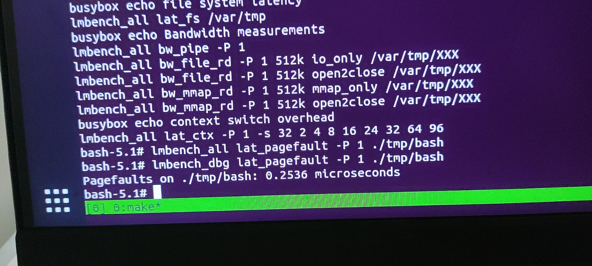

## 问题发现

在`NPUCore`的开发过程中，我们也测试了去年操作系统赛的决赛测例lmbench用于测试操作系统的性能，其中有一项是测试pagefault的时延，当命令输进去之后发生了一件奇怪的事情，程序执行完毕之后直接没有输出了，或是有输出但是值小的不可思议，不可能有那么短的时延：

## 问题探索

刚开始遇到这个问题我们都有点茫然，正常情况下缺页中断的时延确实有，也不低，没有输出也太奇怪的，出于好奇我们先查看了所有的中断、系统调用以及其他调试信息，发生程序正确执行，内核并没有什么信息处理错误，正常返回用户态，一切看上去很正常。

遇到这个错哪都不知道的问题，可能无法从内核调试信息读出可能的问题，抱着用户程序永远是对的信念，我们去阅读了lmbench的源码尝试从用户程序这里获取用户行为，在阅读源码的过程中，发生源码里有一句话很有意思：

`tv_sub`这个函数是将两个时间相减，如果减出来是负数就会将结果置为0，即得出的结果为0秒。

而在输出前有一句话`if (micro == 0.0) return;`意味着如果相减后的值为0的话这个函数直接不输出。

意味着如果`start_tv`如果大于等于`stop_tv`会导致结果完全不输出，但是按照字面意思理解这种情况简直不能再荒谬了，相当于测出来的时间是负数，时光倒流了。

在知道为什么会不输出之后我们就更加不解了，是否是什么系统调用返回的值不对之类的导致`stop_tv`的值变得比`start_tv`小，但是检查每个系统调用的工程量可太大了，不切实际，而且万一查出来不是系统调用的问题就尴尬了。

遇到这个艰难的问题，我们仅剩下了一条退路：使用gdb追踪执行流，对汇编做逆向工程。我们虽然都不想读汇编，但是在关键时刻，必须得读，汇编是最底层的，它完完全全地反映了用户行为，这是一个耗时巨大但是最有效的方法。

我们重新编译了一份带调试信息的lmbench，用qemu虚拟机模拟执行流，用gdb进行追踪：

在追踪后发现`fa5`寄存器实际上对应的是计时一个关键的量，而且在进入一个新函数之后`fa5`的值直接就变了，直到这一刻我们才意识到我们内核的问题。

## 问题原因

`NPUCore`是以清华大学`rCore Tutorial`为框架，在此基础上不断迭代更新变成属于我们的操作系统，在某些方面沿用了`rCore Tutorial`的原有代码，而`rCore Tutorial`终究只是个教程，它并没有考虑到浮点数，正常情况整数运算就足以支撑内核了，这使得在中断发生时只会将整数寄存器保存，并不会保存浮点寄存器，这样就能解释了为什么寄存器值变了。在修改了中断的寄存器保存代码后，数值也正常了：

这么看来，去年的操作系统赛很多队也没意识到这件事，就把这个当成一个“灵异事件”不了了之。我们在经受过好几天的痛苦后终于把这一真相挖掘出来。

## 感悟

经过这一次事件之后让我们意识到计算机世界里确实是没有魔法的，只是等待我们去发掘，这个问题如果意识到浮点寄存器忘保存看起来就非常的简单，但是实际情况上再探索的过程中，我们根本不会去怀疑陷入中断的寄存器保存代码，这已经被用过很久，“根本”不会出问题。如何从不正常的现象中慢慢一步步探索，从看调试信息到读用户程序源码再到追踪执行流，最终找到问题的原因，这个bug的发现让我们获得大量成就感，也正是我们`NPUCore`团队能力的体现，不嫌麻烦一步步探索问题的可能原因，最终弄明白问题的成因。