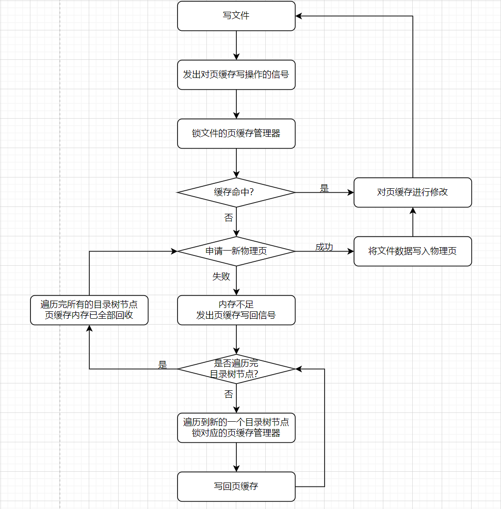
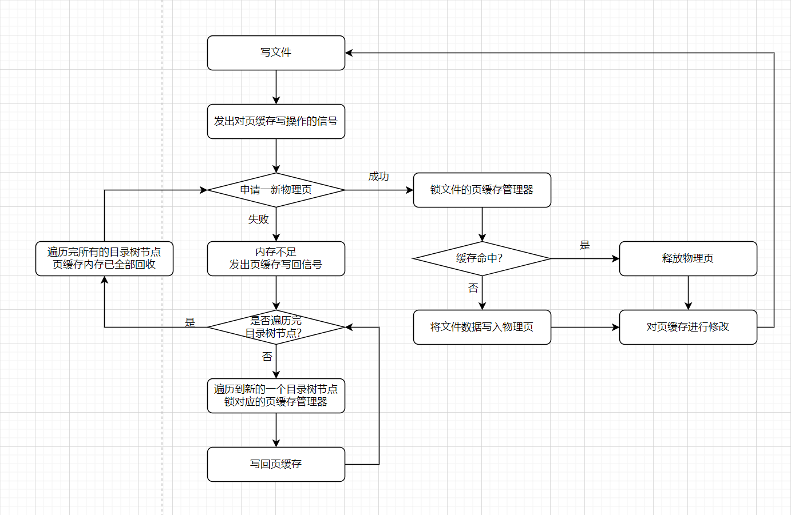

## 问题发现

`NPUCore`在设计文件之初就考虑到了磁盘文件复用的情况，即多个进程在不同时间段会对同一个文件进行读写，多次I/O操作会极大地影响操作系统运行效率。为了减少文件I/O操作，`NPUCore`采取了页缓存策略，将文件修改先在内存中做完，之后再在合适的时机将页缓存写回磁盘中。

`NPUCore`在发生内存不足，无法再分配新的物理页时会遍历文件目录树将所有页缓存写回以回收内存。但是会出现无法回收页缓存内存导致操作系统无法腾出新的物理页的情况，简化的流程如下：

值得一提的是在遍历文件目录树节点时可能会遍历到目前正在写的文件产生死锁问题，`NPUCore`最开始的处理办法是鸵鸟策略，如果文件的页缓存管理器被上锁了，就停止对该文件执行写回页缓存操作。

鸵鸟策略在一开始是十分顺利的，它能够在很多场景下能够表现良好，但是在之后的测试中发现了它的弊端：对一个文件进行大规模写操作会导致文件的页缓存管理器存着近乎所有的页缓存，以至于最终无法腾出新的物理页。

## 问题分析与解决

问题的根源是触发内存不足信号后清理正在写的文件的页缓存时发现文件的页缓存被上锁。页缓存上锁是不可避免的，否则会产生数据竞争。在我们一个下午的讨论后得出一个切入点：

+ 触发内存不足信号是由于需要申请新的物理页
+ 就算最后缓存命中，提前申请新的物理页也是无害的，不会对性能造成太大影响

我们决定将页缓存逻辑稍作修改，采取银行家算法类似的策略，在锁文件的页缓存管理器前需要先申请物理页，这样触发内存不足信号被提前到锁文件的页缓存管理器之前，修改过缓存逻辑后的执行流如下：

通过对执行顺序的调整巧妙地将死锁问题解决，这样对文件进行大规模写操作依然能保证在触发内存不足信号后能够清理正在写的文件的页缓存。