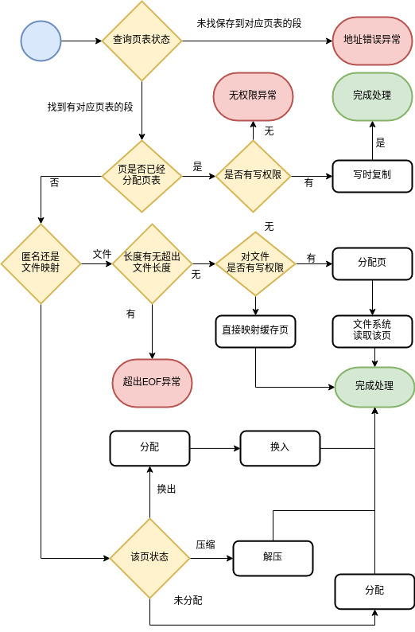
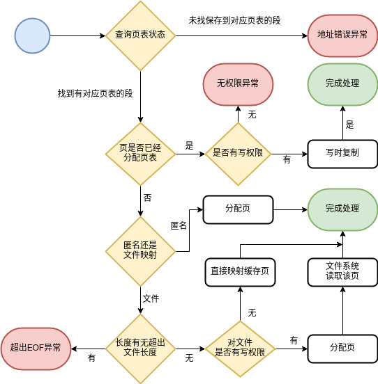

# Table of Contents

1.  [Page Fault](#orge629600)
    1.  [原理](#org8ee4197)
    2.  [几个核心的路径](#org75d4749)
        1.  [无权限的真正Segment Fault(第一第二行的路径)](#org3103d20)
        2.  [文件映射情况(第三行路径)](#org6710d6e)

# Page Fault

**包换页面置换、压缩内存的page fault处理流程：**

**不包换页面置换、压缩内存的page fault处理流程：**

由于k210内存紧张，我们引入了换入换出和zRAM机制（使用Cargo的feature语法条件编译），page fault处理流程相对复杂。

在unmatched上，我们关闭了这个feature以加速内核运行，因此page fault处理流程比较简单。

## 依赖Page Fault的优化（CoW）

通过将两个页表项的W权限位清零, 并且映射到相同的物理页。可以达到共享页和在必要时复制（Copy on Write）的目的。对共享页的写入会产生Page Fault, 此时我们再结合内存描述符以及页表项的情况做出判断和相应处理。 

## 几个核心的路径

### 无权限的真正Segment Fault(第一第二行的路径)

对于原本就没有权限的和没有映射的地址, 会在页表状态(实际通过内存中的"MapArea"(段)结构储存)中查找失败, 然后直接进入无权异常/错地址异常(上方的两个红终止框)

### 文件映射情况(第三行路径)

由于没有权限的情况判断已经由之前的两个路径分支点完成, 这里一定是有权限的, 只是触发的权限是Read还是Write.

进入这个分支的必然是页还没分配的, 对于MapArea中有写入权限的, 按照Linux的默认行为, 是直接写回文件, 所以我们直接将页分配给这里, 然后读取一页的文件即可

对于文件没有写入权限的, 就可以直接映射已经缓存的页, 然后完成. 之后的其他行为和别的已经映射的没有差异

事实上, Linux是允许阻断文件映射对源文件的写回, 但不是默认行为, 我们暂时不考虑

