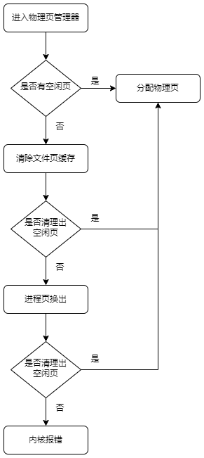

## 页面回收机制

K210由于硬件限制内存仅有8M，为了有效的利用剩余的内存，`NPUCore`支持页面回收机制，当页分配器无法分配新物理页时会触发页面回收机制。

目前`NPUCore`支持两种回收手段

+ 文件页缓存回收
+ 进程页换出

回收关系如下：



### 清除文件页缓存

`NPUCore`通过使用文件页缓存减少硬件I/O提升文件系统性能，但当物理页不足时需要清理文件页缓存空出物理页。

`NPUCore`通过`Inode`结构体存储FAT32内容，其中的`file_cache_mgr`用于维护页缓存信息。

```rust
pub struct Inode {
    /// Inode lock: for normal operation
    inode_lock: RwLock<InodeLock>,
    /// File Content
    file_content: RwLock<FileContent>,
    /// File cache manager corresponding to this inode.
    file_cache_mgr: PageCacheManager,
    /// File type
    file_type: Mutex<DiskInodeType>,
    /// The parent directory of this inode
    parent_dir: Mutex<Option<(Arc<Self>, u32)>>,
    /// file system
    fs: Arc<EasyFileSystem>,
    /// Struct to hold time related information
    time: Mutex<InodeTime>,
    /// Info Inode to delete file content
    deleted: Mutex<bool>,
}
```

当物理页不足时，内核会遍历所有可能的`Inode`，然后向对应的`file_cache_mgr`发送信号通知`Inode`回收物理页。

在回收物理页我们采用的是CLOCK算法，不过有一种特殊情况是当物理页被多个对象共享时不应该释放物理页。

```rust
//内核oom代码
pub fn oom() -> Result<(), ()> {
    //快表缓存失效，让cache中的页表项能够写回内存
    tlb_invalidate();
    const MAX_FAIL_TIME: usize = 3;
    let mut fail_time = 0;
    log::warn!("[oom] start oom");
    let mut lock = DIRECTORY_VEC.lock();
    update_directory_vec(&mut lock);
    loop {
        let mut dropped = 0;
        for inode in &lock.0 {
            let inode = inode.upgrade().unwrap();
            //通知Inode回收物理页
            dropped += inode.file.oom();
        }
        if dropped > 0 {
            log::warn!("[oom] recycle pages: {}", dropped);
            return Ok(());
        }
        fail_time += 1;
        if fail_time >= MAX_FAIL_TIME {
            return Err(());
        }
    }
}
```

### 进程页换出

当文件缓存回收不了物理页时会将进程的页面换出到虚拟内存中，用于减少进程物理页的开销。

虚拟内存的维护采取传统的位图维护，先向文件系统申请若干磁盘空间作为虚拟内存，然后通过位图信息维护这些磁盘空间。

```rust
//虚拟内存具体数据结构设计
pub struct Swap {
    //维护位图
    bitmap: Vec<u64>,
    //维护块id
    block_ids: Vec<usize>,
}
//关键函数
//根据用户手持的swap_id读出磁盘中对应数据
pub fn read(&mut self, swap_id: usize, buf: &mut [u8]) {
    Self::read_page(self.get_block_ids(swap_id), buf);
    //维护位图
    self.clear_bit(swap_id);
}
//用户请求在虚拟内存中分配一页用于写入数据
//返回一个swap_id告知用户该页在虚拟内存中的位置
pub fn write(&mut self, buf: &[u8]) -> usize {
    //在虚拟内存中申请一页
    let swap_id = self.alloc_page().unwrap();
    Self::write_page(self.get_block_ids(swap_id), buf);
    //维护位图
    self.set_bit(swap_id);
    swap_id
}
//如果进程退出，它持有的swap_id将会被释放
#[inline(always)]
pub fn discard(&mut self, swap_id: usize) {
    //维护位图
    self.clear_bit(swap_id);
}
```

页面会将进程获取的匿名页（栈段，堆段，用户通过mmap申请的页面）换出，考虑到K210平台运行的程序体量较小，暂时不支持其余页面换出，因为都是用户代码页，换出会加大I/O开销，让效率变慢。

在换出匿名页的时候可以针对匿名页数据使用zRAM技术进行压缩，存放在内核空间里，从而减少I/O开销，经过测试，4096字节的数据一般能够压缩到一百字节左右，而数据全是相同的数据能够压缩到31字节。

```rust
#[cfg(feature = "oom_handler")]
pub fn do_oom(&mut self, page_table: &mut PageTable) -> usize {
    let start_vpn = self.inner.vpn_range.get_start();
    let compressed_before = self.inner.compressed;
    let swapped_before = self.inner.swapped;
    warn!("{:?}", self.inner.active);
    while let Some(idx) = self.inner.active.pop_front() {
        let frame = &mut self.inner.frames[idx as usize];
        // first, try to compress
        match frame.zip() {
            Ok(zram_id) => {
                page_table.unmap(VirtPageNum::from(start_vpn.0 + idx as usize));
                self.inner.compressed += 1;
                trace!("[do_oom] compress frame: {:?}, zram_id: {}", frame, zram_id);
                continue;
            }
            Err(MemoryError::SharedPage) => continue,
            Err(MemoryError::ZramIsFull) => {}
            _ => unreachable!(),
        }
        // zram is full, try to swap out
        match frame.swap_out() {
            Ok(swap_id) => {
                page_table.unmap(VirtPageNum::from(start_vpn.0 + idx as usize));
                self.inner.swapped += 1;
                trace!("[do_oom] swap out frame: {:?}, swap_id: {}", frame, swap_id);
                continue;
            }
            Err(MemoryError::SharedPage) => continue,
            _ => unreachable!(),
        }
    }
    self.inner.compressed + self.inner.swapped - compressed_before - swapped_before
}
```