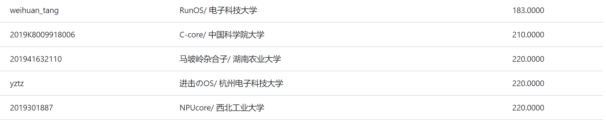

# Welcome to NPUcore👋

[](https://img.shields.io/badge/Lang-Rust-green) [](https://img.shields.io/badge/ISA-riscv64-yellowgreen) [](https://img.shields.io/badge/Platform-Qemu%2c%20k210%20%26%20Hifive%20Unmatched-yellow)

### 简介

`NPUcore`是来自西北工业大学的三位同学基于清华大学`rCore Tutorial`框架，参考借鉴去年内核赛道优秀参赛队伍与Linux内核的诸多优秀设计，并结合硬件平台特性进行优化和重构，不断迭代形成的竞赛操作系统，现已支持`qemu`、`k210`、`Hifive Unmatched`三平台的运行。

### 特性

+ 完善的内核功能支持

`NPUcore`根据Linux Manual支持或不完全支持的系统调用多达87个，且较为完整地实现了信号机制，线程等功能，在决赛第一阶段针对C库接口的测试程序`libc-test`中获得了满分。但我们的目标并不仅仅是通过测试用例，而是希望`NPUcore`具有一定的趣味性和实用性，这就要求`NPUcore`能够运行更多用户程序。因此我们支持了bash这个许多Linux发行版的默认shell，结合busybox可以获得较好的CLI使用体验。

+ 精巧的内存管理

`NPUcore`最初面向`k210`平台，由于`k210`只有8MB内存空间，有限的空间驱使`NPUcore`团队围绕内存管理做了很多工作：懒分配、写时复制、zRAM，虚拟内存等。这些机制使得内存能够得到尽可能的利用，能够支撑更多用户程序。

+ 基于等待队列的阻塞

阻塞与非阻塞是资源访问的两种方式。在非阻塞的资源访问下，通常要使用轮询来检查待获取的资源是否就绪，这种反复查询的操作会造成CPU资源的浪费。`NPUCore`实现了基于等待队列的系统资源访问，`futex`等系统调用使用等待队列实现，能够提高内核事件通知和资源访问的效率。

+ 块缓存和页缓存

`NPUcore`团队通过对函数调用的跟踪统计发现文件系统在I/O时的等待有极大的开销，为了提高系统I/O性能, `NPUcore`实现了类似Linux的Buffer Cache(块缓存)和Page Cache(页缓存)，Buffer Cache缓存块设备上的数据块，加速对存储器的访问。Page Cache缓存文件的逻辑内容, 加速对文件内容的访问。此外，考虑到`k210`的内存有限，而Buffer Cache和Page Cache之间又存在数据冗余，`NPUcore`尝试将Buffer Cache和Page Cache之间重复的数据映射到相同的物理页，并且进行维护，确保不会出现一致性问题。这样能够提升内存利用率，减少Buffer Cache和Page Cache之间的拷贝。此外，我们还根据Fat区和数据区的特性设计了不同的缓存策略，使得文件系统的I/O性能大幅上升。

`NPUcore`使用较为激进的缓存策略，Page Cache容量不设上限，所有的内存空间都可以作为缓存使用。发生内存不足时，`NPUcore` 会根据LRU算法清理无用缓存。经过测试发现，在这种缓存策略下运行大多数测例时，对每个文件`NPUcore`只从外存读取一次，之后的读写全部发生在Cache中，从而带来极大的性能提升。

+ 高效可扩展的虚拟文件系统

在前期开发中，`NPUCore`团队注意到文件目录的查找操作每次都需要访问底层文件系统，反复读取Fat区和数据区，造成了巨大的耗时。`NPUcore`在开发过程中对虚拟文件系统进行了重写，引入了目录树这一数据结构，作为文件目录逻辑结构的缓存，一些文件系统操作如切换目录等在缓存命中时不再需要访问底层文件系统，大幅减少文件I/O，使文件操作更加高效。

另外，在Linux的VFS中，同一文件操作可以通过函数指针实现对不同底层文件系统的函数调用，这其实是一种由C语言实现的“多态”。我们借鉴这种思想，使用Rust的语法将文件操作trait化，这样能够让VFS具有更高的可扩展性。

+ 稳定性

`NPUcore`遵循软件工程的思想，在每次合并新模块后都会进行压力测试和回归测试，能够尽可能发现系统中隐藏的bug。结合完善的运行日志系统，QEMU远程调试和JTAG硬件调试，可以迅速定位问题并加以解决。这使得`NPUcore`有相当的稳定性，能够在`k210`开发板上循环运行决赛测例长达6小时。

### 决赛第一阶段完成情况

`NPUcore`在决赛第一阶段完成了`libc-test`的所有测试用例的支持，拿到了`k210`赛道220分满分的成绩，同时也支持了`fu740`平台，在`Unmatched`赛道拿到了满分，成为了为数不多的支持双赛道的队伍之一。

##### k210赛道


##### unmatched赛道


### 分支介绍

- master——最新代码及文档
- comp-1——初赛提交分支
- comp-2——决赛一阶段提交分支（k210）
- comp-2-qemu——决赛一阶段提交分支（qemu）
- comp-2-fu740——决赛一阶段提交分支（fu740）
- comp-3——决赛二阶段提交分支（k210）
- comp-3-qemu——决赛二阶段提交分支（qemu）
- comp-3-fu740——决赛二阶段提交分支（fu740）
- extend——扩展内容

### 如何运行

**交互式运行**

准备工作

````shell
make all # 构建`bash`与`initproc`
cd os && make fat32 # 进入`os`目录，构建文件系统镜像
````

在QEMU上运行：

````shell
make run # 直接运行
````

在k210上运行：

````shell
make sdcard # 将文件系统镜像写入sdcard
make run BOARD=k210 # 烧写运行
````

PS：

1. 在OS运行时直接关闭模拟器或者拔下k210有概率写坏文件系统，如果遇到这种情况，请重新构建文件系统镜像（将文件系统镜像重新写入sdcard）。
2. 按以上步骤构建的文件系统镜像仅含`initproc`和`bash`，如果需要使用更多用户程序，请修改`buildfs.sh`或者手动将ELF文件拷贝到镜像中。

### 模块与特性相关文档

+ [信号](./Doc/os/signal.md)
+ [oom handler](./Doc/os/oom.md)
+ [Page Fault & CoW](./Doc/mm/page_fault.md)
+ [futex系统调用](./Doc/task/futex.md)
+ [修改RustSBI处理不对齐读](./Doc/debug/rustsbi%E4%B8%8D%E5%AF%B9%E9%BD%90%E8%AF%BB.md)
+ [常数优化](./Doc/debug/常数优化相关方法.md)

### Fat32文件系统教程

`NPUcore`在开发文件系统的同时记录了开发的心路历程，整理成了一份教程。`NPUcore`团队的理念是：对的方式千篇一律，错的方式千奇百怪，为什么是错的比什么是对的更加重要。所以这份教材会记录我们走过的弯路，希望能够为那些想从零开始写Fat32文件系统的人提供一些帮助。

+ [来自NPUcore的Fat32文件系统教程](./Doc/fs/fat.md)
+ [Linux下的短目录名生成](./Doc/fs/Linux%E4%B8%8B%E7%9A%84%E7%9F%AD%E7%9B%AE%E5%BD%95%E5%90%8D%E7%94%9F%E6%88%90.md)
+ [代码文档: easy-fs-doc](./Doc/fs/easy-fs-doc.md)

### Debug相关文档

以下是我们在开发中遇到的各种bug和解决方法。

+ [Virt-IO驱动跨页问题](./Doc/debug/Virt-IO%E9%A9%B1%E5%8A%A8bug.md)
+ [浮点寄存器的保存](./Doc/debug/%E6%B5%AE%E7%82%B9%E5%AF%84%E5%AD%98%E5%99%A8bug.md)
+ [清理页缓存导致死锁](./Doc/debug/%E6%B8%85%E7%90%86%E9%A1%B5%E7%BC%93%E5%AD%98%E6%AD%BB%E9%94%81.md)
+ [read/write错误返回EFAULT](./Doc/debug/EFAULT技术细节.md)
+ [vi不能输入](./Doc/debug/vi不能输入bug.md)
+ [vi返回异常](./Doc/debug/vi返回异常bug.md)

### 其他技术细节

+ [页表项刷新相关细节](./Doc/debug/%E9%A1%B5%E8%A1%A8%E9%A1%B9%E5%88%B7%E6%96%B0%E7%9B%B8%E5%85%B3%E7%BB%86%E8%8A%82.md)
+ [Rust的传锁方法](./Doc/debug/Rust%E7%9A%84%E4%BC%A0%E9%94%81%E6%96%B9%E6%B3%95.md)
+ [提升SD卡驱动稳定性](./Doc/debug/sd%E5%8D%A1%E9%A9%B1%E5%8A%A8%E5%93%8D%E5%BA%94%E5%A4%B1%E8%B4%A5bug.md)
+ [TTY回显问题](./Doc/debug/TTY不回显bug.md)
