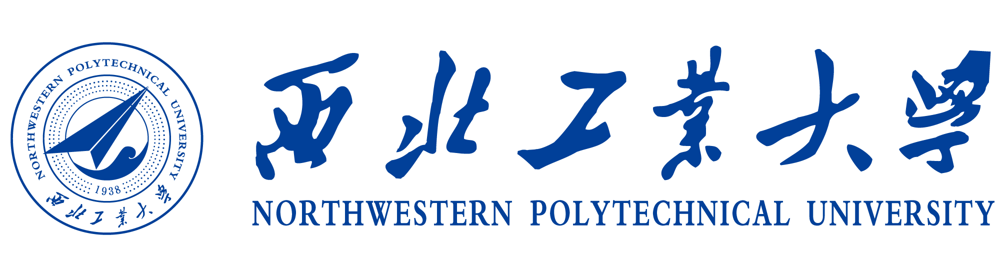

# 操作系统能力大赛内核赛-西北工业大学队作品仓库
本仓库中收录了历届大赛中西工大战队的优秀作品

# 文件说明
 + `NPUcore_2021` : 2021届系统能力大赛的最终作品，主体采用C语言
 + `NPUcore_2022` : 2022届系统能力大赛的最终作品，主体采用Rust语言  
 
打开往年的参赛作品后，请首先查看`README文件`

# 其他
## 1）大赛其他优秀作品
除了本校战队的作品外，还有许多其他院校的优秀作品，下附链接：

### 历届冠军队及优秀队作品列表
| 学校 | 队伍名称 | 比赛时间 | 主体语言 | 基础内核 | 测试平台 | 链接 |
| :-: | :-: | :-: | :-: | :-: | :-: | :-: |
| 哈尔滨工业大学(深圳) | UltraOS | 2021 | Rust | rcore | qemu、K210 | https://gitlab.eduxiji.net/ultrateam/ultraos |
| 北京航空航天大学 | 图漏图森破 | 2022 | C | ucore | qemu、K210、U740 | https://gitlab.eduxiji.net/19373469/oskernel2022-x |
| 哈尔滨工业大学(深圳) | FTL OS | 2022 | Rust | rcore | qemu、K210、U740 | https://gitlab.eduxiji.net/DarkAngelEX/oskernel2022-ftlos |

### 大赛完整排行榜链接（榜单顺序按队伍最终成绩从高到底）
 + 2021届：
 https://os.educg.net/2021CSCC?op=5  
 + 2022届：
 https://os.educg.net/2022CSCC?op=5  

## 2）操作系统课程实验
其他校也有许多优秀的操作系统课程，大家如有兴趣，可以选择适合自己的，下附链接：  
（其中的rcore即为ucore的Rust语言版本）
| 学校 | 课程 | ISA | 主体语言 | 测试平台 | 链接 |
| :-: | :-: | :-: | :-: | :-: | :-: |
| 清华大学 | rcore | RISC-V | Rust | qemu、K210 | https://rcore-os.cn/rCore-Tutorial-Book-v3/ |
| 清华大学 | ucore | RISC-V | C | qemu | https://learningos.github.io/uCore-Tutorial-Guide-2022S/ |
| MIT | 6.S081 | RISC-V | C | qemu | https://pdos.csail.mit.edu/6.S081/2020/schedule.html |
| MIT | 6.828 | x86 | C | qemu | https://pdos.csail.mit.edu/6.828/2018/schedule.html |
