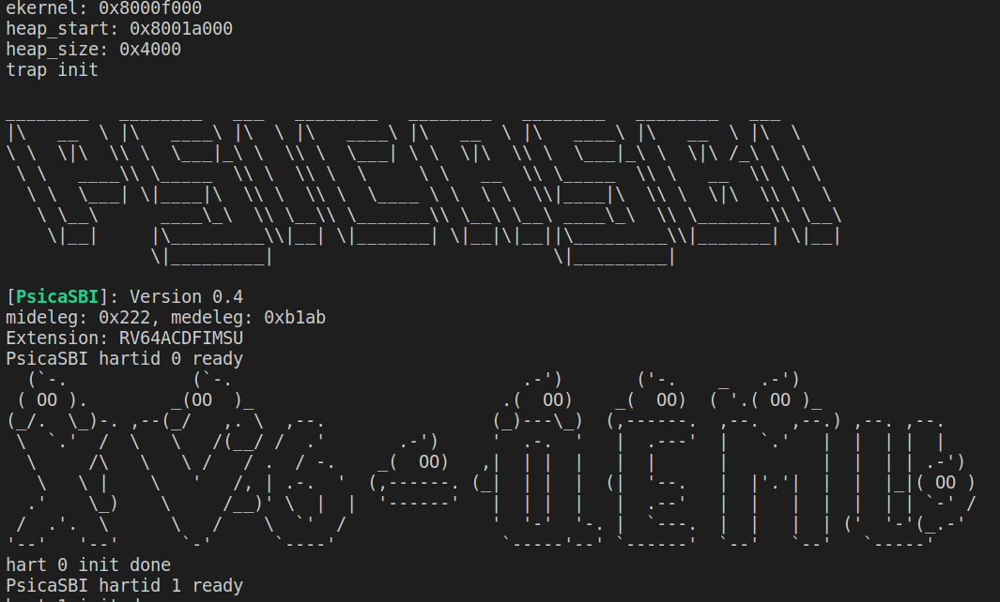
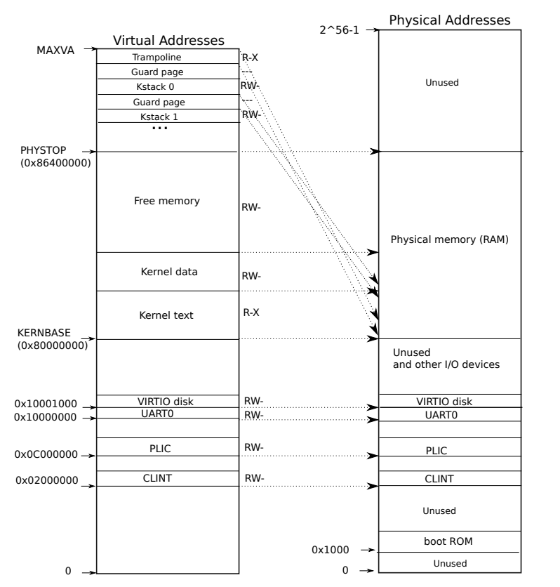

# 注意事项
1) 对于OS源码的理解会耗费大量时间，请大家尽早开始实验！！！大家具体实现的代码各不相同，没有人知道你代码为什么出错，调试基本只能靠自己。  
2) 强烈建议大家在完成实验时配合使用git，并在每次修改代码后commit一下。（建议在gitee或github上开设仓库，以防止意外造成的代码丢失）
3) 请使用rCore来完成下列实验。NPUcore已经实现了下述的部分实验，可以作为参考，但还是建议大家先自己尝试完成实验。


# 个人项目

# 目录链接：  
[第10周_系统调用](#第10周_系统调用)  
[第11周_内存管理](#第11周_内存管理)  
[第12周_进程管理](#第12周_进程管理)  
[第13周_文件系统](#第13周_文件系统)


# 第10周_系统调用
## 实验
1) 实现一个属于你的系统调用，并写一个用户进程来调用该系统调用。该系统调用的功能为：输出你的名字(拼音即可)和学号。
2) 设计你自己的OS标签。让内核在开机启动时，输出你的标签。输出结果类似下图：  
（可以参考使用的网站：http://patorjk.com/software/taag ）



## 成长故事要求：
1) 请详细阐述中断发生后的整个处理流程：从中断发生处开始，到返回原中断处结束。务必配合上相关代码及注释说明。  
   （注意：`用户态下发生中断`和`内核态下发生中断`时的处理流程有一定的区别，请分开阐述）
2) 阅读pipe系统调用的代码，并说明pipe的工作原理。pipe如何实现了“无限的长度”？


# 第11周_内存管理
## 实验
1) 打印出内核页表。打印的格式如下：  
```
 page table 0x0000000087f6e000  
..0: pte 0x0000000021fda801 pa 0x0000000087f6a000  
.. ..0: pte 0x0000000021fda401 pa 0x0000000087f69000  
.. .. ..0: pte 0x0000000021fdac1f pa 0x0000000087f6b000  
.. .. ..1: pte 0x0000000021fda00f pa 0x0000000087f68000  
.. .. ..2: pte 0x0000000021fd9c1f pa 0x0000000087f67000  
..255: pte 0x0000000021fdb401 pa 0x0000000087f6d000  
.. ..511: pte 0x0000000021fdb001 pa 0x0000000087f6c000  
.. .. ..510: pte 0x0000000021fdd807 pa 0x0000000087f76000  
.. .. ..511: pte 0x0000000020001c0b pa 0x0000000080007000  
```
（你自己打印出来的内核页表和这个不一定相同）  
其中，对于` “  ..0: pte 0x0000000021fda801 pa 0x0000000087f6a000  ”  `  
`..` ：代表当前的页表等级（零级、一级、二级）  
`0`：代表当前页表项的序号  
`pte 0x0000000021fda801`：代表当前页表项中的内容  
`pa 0x0000000087f69000`：代表当前页表项指向的物理页的地址

~~2) 将sbrk系统调用改为懒分配机制 （参考：https://rcore-os.cn/rCore-Tutorial-Book-v3/chapter4/8exercise.html 中的`lazy策略`）~~

## 成长故事要求：
1) 请画出内核页表中各个区域和物理地址区域的对应情况，格式类似下图：
  
~~2) 请阐述sbrk使用懒分配的工作原理。务必配合上相关代码及注释说明。~~
3) 开始使用虚拟地址后，页表寄存器（SATP，Supervisor Address Translation and Protection Register）中存储的页表地址需要经过MMU的转换吗？为什么？  
~~4) 请描述一个虚拟地址到物理地址的整个转换过程。~~

# 第12周_进程管理
## 实验
~~1) 利用时钟中断来实现时间片轮转的进程调度。（即每次发生时钟中断时，都进行一次进程调度）~~  

1) 实现进程的copy on wirte机制，并自行创建一个会fork多次的用户进程来检验COW的实现情况。
（参考：https://rcore-os.cn/rCore-Tutorial-Book-v3/chapter4/8exercise.html 中的`COW机制`)    
**注意：不要求对多线程版本的支持，多进程版本的COW即可（可以使用rcore分支中的ch5）。当然你想做多线程也没问题 :)**  
一些实现COW机制的提示：
   1) 修改fork系统调用。在fork时，对于内存空间只进行页表的索引链接，而不是整体复制；同时，修改页表项中的标志位
   2) 修改exit系统调用。要考虑exit时物理内存页的释放问题，因为在实现了COW后，一个物理内存页的使用者（进程）可能有多个，要保证其释放者是最后一个仍在使用该页的进程。（提示：可用一种数据结构来记录每个物理页的refer_count，当refer_count减到0时，释放该物理页）
   3) 缺页中断处理函数的实现。缺页类型为COW时，分配新的物理页，并复制内容，同时修改物理页的refer_count，还要修改页表项中的标志位。
   4) 可用性检验及性能优化。
      1) 可用性检验。
         1) 修改makefile，把QEMU提供的内存改小（eg：改成5MB）。然后写一个会fork多次的用户程序（eg：fork 100次）
         2) 写一个检测物理页剩余数量的系统调用，以供用户程序使用。（提示：可以在内核最初开机初始化内存时，记录下所有的物理页数量，然后在内存的分配和回收函数中修改物理页剩余数量）
      2) 性能优化。在fork系统调用中修改页表项标志位时，代码区（R-X，可读|不可写|可执行）不会发生修改（不会触发COW类型的缺页中断），只有数据区（RW-，可读|可写|不可执行）可能发生修改。想想怎样让fork的速度更快。

## 成长故事要求：
1) 请详细阐述进程的切换过程：从一个用户进程在正常执行时遇到中断或执行完毕开始，然后陷入内核态中切换进程，到最后返回到用户态后执行新的用户进程结束。务必配合上相关代码及注释说明。  
~~2) 请详细阐述你实现时间片轮转的方式，务必配合上相关代码及注释说明。~~  
3) 请详细阐述你的cow实现过程，务必配合上相关代码及注释说明。
4) 解释PCB（进程结构体）中各个变量的意义。

# 第13周_文件系统
**（注意：第13周任务截止时间为15周周三(12月7日) 23:59）**
## 实验
1) 请用调试软件（推荐GDB，其它亦可）跟踪`open`和`read`系统调用的整个运行流程，并配合代码讲解。注意文件类型有多种，如`pipe`、`file（普通文件类型）`和`directory（文件夹）`，请分别叙述。（主要是希望大家理解 “虚拟文件系统（Virtual File System，VFS）”和“文件系统（eg：FAT32、EXT4等）”的工作原理）

## 成长故事要求：
1) rcore的文件系统有哪几层？各个层的功能是什么？
2) 软链接和硬链接是干什么的？有什么区别？当删除一个软链接或硬链接时分别会发生什么？


